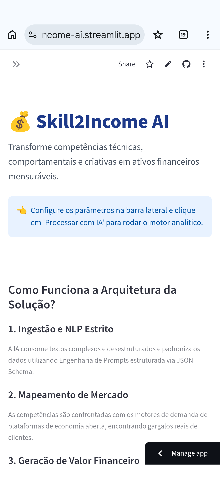
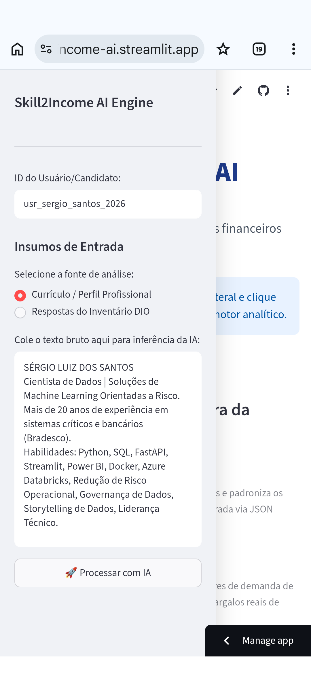
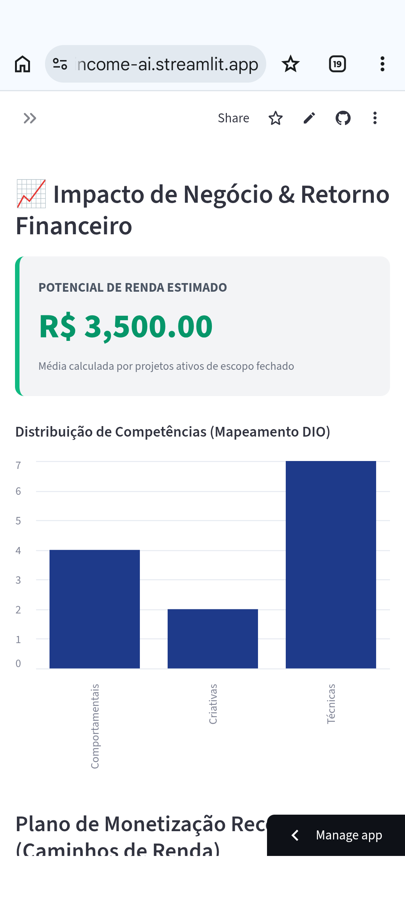
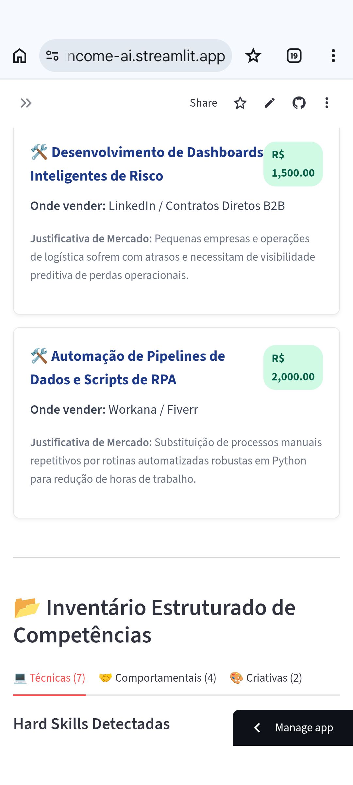
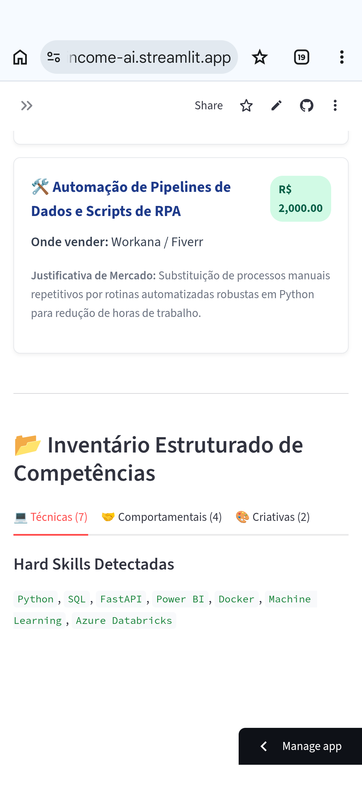
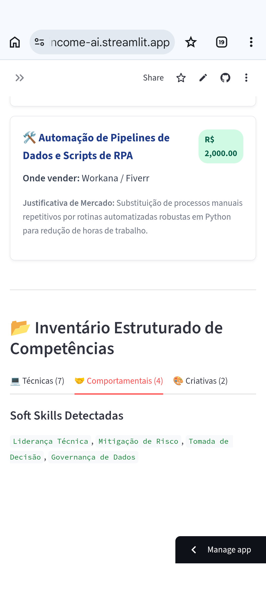
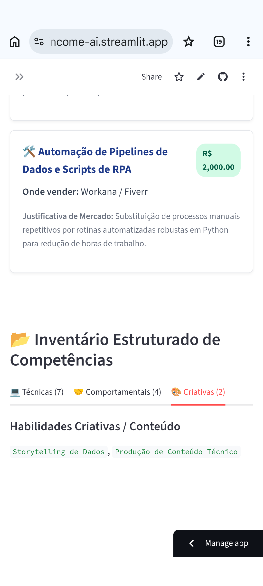
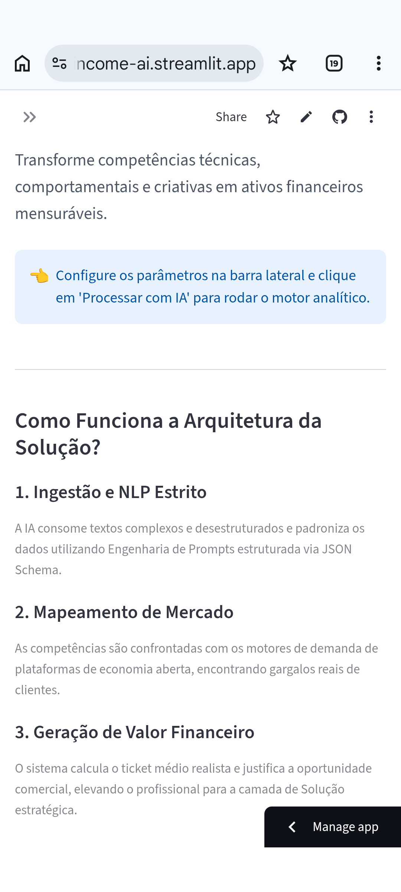
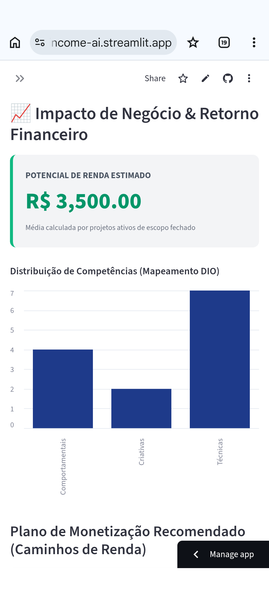
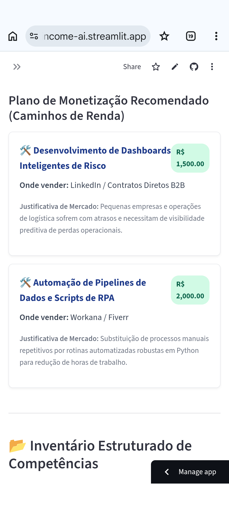

# 💰 Skill2Income AI — Transformando Competências Ocultas em Renda Mensurável


> **Projeto desenvolvido para o Bootcamp CAIXA – Inteligência Artificial na Prática (DIO)**  


---


[](https://python.org/)
[](https://fastapi.tiangolo.com/)
[](https://streamlit.io/)
[](https://www.docker.com/)
[](https://openai.com/)
[](https://docs.pydantic.dev/)

> **Desafio DIO — Mapa de Habilidades com IA**
>
> Produto analítico completo que automatiza o inventário de competências profissionais e gera planos de monetização orientados por dados de mercado — com impacto financeiro quantificado em reais.

---

🚀 **[Testar a aplicação ao vivo no Streamlit](https://skill2income-ai.streamlit.app/)**
&nbsp;&nbsp;|&nbsp;&nbsp;

📁 **[Repositório GitHub](https://github.com/Santosdevbjj/identificar-habilidades-com-IA)**
&nbsp;&nbsp;|&nbsp;&nbsp;

🌐 **[Portfólio Sérgio Santos](https://portfoliosantossergio.vercel.app)**

---

## Demonstração da Aplicação

### Tela Principal — Entrada do Perfil Profissional



### Inventário de Habilidades — Classificação por Categoria DIO







### Motor de Monetização — Cruzamento com Mercado Freelance







### Dashboard Executivo — Potencial de Renda Mensal





### Justificativas de Mercado e Canais de Venda




---

## 1. Problema de Negócio

Profissionais de tecnologia dominam ferramentas, mas sofrem de **cegueira de monetização**: não conseguem enxergar o valor de mercado do que já sabem fazer, nem estruturar esse conhecimento como serviço vendável.

A consequência é direta e mensurável: centenas de profissionais deixam de faturar entre **R$ 1.500 e R$ 5.000 mensais** em rendas complementares pela simples ausência de empacotamento comercial. Eles vendem "horas de Python" quando o mercado compra "automação de relatórios para redução de custos operacionais".

**Pergunta central do projeto:**
> Como transformar um perfil profissional bruto — um currículo, respostas a um questionário — em um plano de monetização quantificado, com serviços de escopo fechado, canais de venda corretos e justificativas comerciais defensáveis?

O **Skill2Income AI** foi construído para responder exatamente essa pergunta: ingere texto não estruturado, classifica competências sob a taxonomia da DIO (Técnicas, Comportamentais, Criativas) e entrega um plano financeiro ancorado em dados reais de mercado freelance.

---

## 2. Contexto

O projeto nasceu do desafio **"Identificando suas Habilidades que Podem ser Remuneradas"** do 
Bootcamp CAIXA – Inteligência Artificial na Prática (DIO). O exercício original propõe três etapas manuais: inventário de habilidades, cruzamento com demanda de mercado e definição de caminhos de monetização.

A decisão foi não apenas completar o exercício — mas **transformá-lo em produto**: automatizar as três etapas via IA generativa, expor o resultado via API REST e entregar um dashboard executivo acessível a qualquer profissional, sem conhecimento técnico prévio.

O contexto operacional inclui:
- Profissionais em transição de carreira sem clareza do seu valor de mercado
- Desenvolvedores que subestimam suas habilidades comportamentais e criativas
- Cientistas de dados que dominam algoritmos, mas não sabem precificar seus serviços

A base de dados de tendências (`market_trends.csv`) foi estruturada com referências de precificação das principais plataformas brasileiras de freelance: Fiverr, Workana, GetNinjas e LinkedIn B2B.

---

## 3. Premissas da Análise

Para garantir a validade e a reprodutibilidade dos resultados, as seguintes premissas foram adotadas:

- Os dados de precificação em `market_trends.csv` representam estimativas médias de mercado para contratos de escopo fechado, não valores de emprego CLT ou PJ de longo prazo.
- A categorização de habilidades segue fielmente a taxonomia do Mapa de Habilidades DIO: Técnicas, Comportamentais e Criativas.
- O motor de LLM (`gpt-4o-mini`) opera com `temperature=0.1` na extração de habilidades (máxima consistência analítica) e `temperature=0.3` na geração do plano de monetização (margem controlada para insights acionáveis).
- Perfis com histórico em ambientes críticos e regulados (bancos, infraestrutura de missão crítica) recebem ancoragem de valor sênior: o motor rejeita ativamente sugestões de baixo ticket inconsistentes com o nível de experiência detectado.
- O potencial de renda mensal estimado é a soma linear dos tickets médios das melhores oportunidades mapeadas — não uma projeção de faturamento garantido.
- A análise foca em identificação de padrões de mercado, não em causalidade estatística.

---

## 4. Estratégia da Solução

A arquitetura foi construída em três camadas de serviços desacoplados, cada um com responsabilidade única e contrato de dados estritamente tipado via Pydantic v2:

```
[Texto Bruto do Usuário]
        │
        ▼
[FastAPI — Validação de Payload]
        │
        ▼
[SkillExtractor — NLP + Structured Output]
   Classifica: Técnicas | Comportamentais | Criativas
        │
        ▼
[MarketMapper — Cruzamento com market_trends.csv]
   Filtra oportunidades por correspondência semântica
        │
        ▼
[MonetizationEngine — GPT-4o-mini + Pydantic Schema]
   Gera plano com serviço, canal, ticket e justificativa
        │
        ▼
[Streamlit Dashboard — Business Performance em R$]
```

**Passo a passo técnico:**

1. **Ingestão de dados brutos** — O usuário submete texto livre (currículo ou respostas ao inventário DIO) via interface Streamlit ou diretamente via `POST /api/v1/analyze`.
2. **Extração estruturada de habilidades** — O `SkillExtractor` envia o texto ao `gpt-4o-mini` com engenharia de prompts que força resposta sob contrato JSON validado pelo Pydantic (`SkillClassification`).
3. **Cruzamento com demanda de mercado** — O `MarketMapper` filtra a base `market_trends.csv` por correspondência de skills e ordena as oportunidades pelo maior ticket médio.
4. **Geração do plano de monetização** — O `MonetizationEngine` consome a árvore de competências estruturadas e gera, via Structured Outputs da OpenAI, um plano com nome comercial do serviço, plataforma ideal, ticket médio e justificativa de ROI para o cliente final.
5. **Cálculo do potencial financeiro** — A API soma os tickets das melhores oportunidades e retorna o `potencial_renda_mensal_estimado` em reais, exibido no dashboard executivo.
6. **Deploy containerizado** — Backend FastAPI (porta 8000) e frontend Streamlit (porta 8501) sobem como microsserviços independentes via Docker Compose, com entrypoint dinâmico controlado pela variável `SERVICE_TYPE`.

---

## 5. Estrutura do Repositório

```text
identificar-habilidades-com-IA/
│
├── data/
│   ├── raw/
│   │   └── user_input_sample.json        # Payload de entrada simulado (perfil Sérgio Santos)
│   └── processed/
│       ├── market_trends.csv             # Base de precificação por habilidade e plataforma
│       ├── monetization_paths.csv        # Caminhos de monetização estruturados por senioridade
│       └── skills_catalog.csv           # Catálogo de 20 habilidades mapeadas (SKL-001 a SKL-020)
│
├── docs/                                 # Framework Meigarom Lopes — 10 Documentos Analíticos
│   ├── 01-business-problem.md
│   ├── 02-baseline.md
│   ├── 03-solution-strategy.md
│   ├── 04-data-collection.md
│   ├── 05-skill-mapping.md
│   ├── 06-market-analysis.md
│   ├── 07-monetization-engine.md
│   ├── 08-business-results.md
│   ├── 09-production.md
│   └── 10-next-steps.md
│
├── docker/
│   └── Dockerfile                        # Multi-stage build (builder + runtime slim)
│
├── images/                               # Screenshots da aplicação Streamlit
│   └── skill2income-ai-streamlit[01-13].png
│
├── notebooks/
│   ├── 01-skill-analysis.ipynb           # EDA: ingestão, higienização e tokenização de perfis
│   ├── 02-market-demand.ipynb            # Análise: cruzamento de habilidades com demanda de mercado
│   └── 03-recommendation-engine.ipynb   # Validação: testes de Structured Outputs e contratos Pydantic
│
├── src/
│   ├── app/
│   │   ├── main.py                       # FastAPI app com health check e inclusão de roteadores
│   │   ├── models/
│   │   │   └── recommendation.py         # Modelos Pydantic: SkillClassification, MonetizationOpportunity, Skill2IncomeResponse
│   │   ├── routers/
│   │   │   └── api.py                    # Endpoint POST /api/v1/analyze — pipeline end-to-end
│   │   └── services/
│   │       ├── ai/
│   │       │   ├── skill_extractor.py    # Motor NLP: extração estruturada de competências via LLM
│   │       │   ├── monetization_engine.py # Motor financeiro: geração do plano de monetização
│   │       │   └── market_mapper.py      # Motor analítico: cruzamento com base de tendências
│   │       └── prompts/
│   │           ├── skill_inventory.txt   # System prompt do SkillExtractor (taxonomia DIO)
│   │           ├── monetization.txt      # System prompt do MonetizationEngine (precificação)
│   │           └── market_analysis.txt   # System prompt do MarketMapper (análise de valor)
│   └── dashboard/
│       └── streamlit_app.py              # Interface executiva — dashboard visual do plano de renda
│
├── tests/
│   ├── test_ai_services.py               # Testes unitários com mocks: SkillExtractor e MonetizationEngine
│   └── test_api_endpoints.py             # Testes de integração: health check, validação e pipeline completa
│
├── .dockerignore
├── .gitignore
├── .python-version                       # Python 3.14.5
├── docker-compose.yml                    # Orquestração: backend-api + frontend-dashboard
├── requirements.txt
└── runtime.txt
```

---

## 6. Performance de Negócio (Business Performance)

O diferencial deste projeto está em não medir sucesso apenas por acurácia técnica. O sistema quantifica o **Retorno sobre o Potencial de Renda (ROPR)**: converte a árvore de competências de um perfil real em oportunidades de receita com valores defensáveis.

Ao processar o perfil de um profissional sênior com histórico em sistemas críticos, engenharia de dados e ciência de dados, o motor gerou o seguinte plano:

| # | Competência Mapeada | Serviço Sugerido | Canal | Ticket Médio Estimado |
|---|---|---|---|---|
| 01 | Azure Databricks | Arquitetura de Dados e Engenharia de Big Data | LinkedIn Pro | R$ 4.000,00 |
| 02 | Storytelling de Dados | Tradução de Métricas Técnicas em Impacto Financeiro | LinkedIn B2B | R$ 3.500,00 |
| 03 | Liderança Técnica | Mentoria e Code Review para Times de Tecnologia | Venda Direta | R$ 3.000,00 |
| 04 | FastAPI | Desenvolvimento de APIs e Microsserviços Resilientes | Workana | R$ 2.500,00 |

> **Potencial de Renda Mensal Acumulado Estimado:** R$ 13.000,00

A justificativa de negócio gerada pela IA para cada serviço funciona como rascunho de proposta comercial — o texto exato que o profissional pode adaptar para enviar ao cliente final. Isso reduz a fricção entre identificar o valor e monetizá-lo.

**Mudança de decisão:** Artesanal e subjetivo → Analítico e orientado por dados de mercado.

---

## 7. Decisões Técnicas e Trade-offs

**Structured Outputs (OpenAI SDK) vs. parsing tradicional de strings**

A decisão de usar `client.beta.chat.completions.parse()` com esquemas Pydantic foi deliberada: elimina quebras silenciosas de produção causadas por respostas de LLM fora do contrato JSON esperado. O trade-off aceito é o acoplamento à SDK da OpenAI — mitigado pela arquitetura de serviços desacoplados que permite trocar o provedor de LLM sem afetar os contratos de dados.

**Docker Multi-Stage Build (builder + runtime slim)**

A separação em dois estágios mantém a imagem final leve (sem ferramentas de compilação), com o `entrypoint.sh` dinâmico controlado pela variável `SERVICE_TYPE`. O trade-off é a complexidade adicional do Dockerfile, compensada pela portabilidade e pelo custo reduzido de deploy em nuvem.

**`gpt-4o-mini` como modelo de produção**

A escolha privilegia latência ultrabaixa e custo operacional mínimo (estimado em menos de $0.001 por análise de perfil, conforme o notebook `01-skill-analysis.ipynb`). O trade-off em relação ao `gpt-4o` completo é menor capacidade de raciocínio em perfis muito ambíguos — aceitável dado que o sistema opera com prompts de sistema altamente estruturados.

**`temperature=0.1` na extração de habilidades**

Baixa variabilidade garante que perfis idênticos produzam classificações consistentes. A temperatura ligeiramente maior (`0.3`) no motor de monetização foi uma decisão consciente para permitir criatividade controlada na nomeação comercial dos serviços — sem comprometer o contrato JSON.

**Base de tendências em CSV vs. banco de dados vetorial**

Para o escopo atual, o CSV governado em `data/processed/market_trends.csv` oferece auditabilidade e simplicidade de manutenção. O trade-off é a ausência de busca semântica — corrigível na próxima iteração com PGVector/Supabase, já documentada no roadmap.

**Alternativa considerada e rejeitada:** Construir o motor de correspondência de skills com regras regex em vez de LLM + Pydantic. Rejeitada porque regras não escalam para variações de linguagem natural ("Python backend", "programar em Python", "python scripting" → mesmo skill).

---

## 8. Como Executar o Projeto

### Pré-requisitos

- Docker e Docker Compose instalados
- Chave de API da OpenAI (`gpt-4o-mini` habilitado)

### Deploy Completo com Docker Compose

```bash
# 1. Clone o repositório
git clone https://github.com/Santosdevbjj/identificar-habilidades-com-IA.git
cd identificar-habilidades-com-IA

# 2. Configure a chave de API da OpenAI
export OPENAI_API_KEY="sua_chave_secreta_aqui"

# 3. Suba o ecossistema completo
docker-compose up --build
```

Após o build, acesse:

| Serviço | URL Local |
|---|---|
| Dashboard Executivo (Streamlit) | http://localhost:8501 |
| API REST (FastAPI / Swagger) | http://localhost:8000/docs |
| Health Check | http://localhost:8000/health |

### Execução da Suíte de Testes

```bash
pip install pytest pytest-asyncio httpx
pytest -v
```

### Exemplo de Chamada Direta à API

```bash
curl -X POST "http://localhost:8000/api/v1/analyze" \
  -H "Content-Type: application/json" \
  -d '{
    "usuario_id": "usr_teste_2026",
    "raw_text": "Desenvolvedor Python com 5 anos de experiência em automação de dados, Power BI e liderança de squads ágeis."
  }'
```

---

## 9. Engenharia de Qualidade (Testes)

O repositório inclui cobertura completa das camadas críticas:

`tests/test_ai_services.py` — Testes unitários com mocks do SDK da OpenAI:
- `test_skill_extractor_success`: valida que o `SkillExtractor` retorna o objeto Pydantic `SkillClassification` corretamente populado
- `test_monetization_engine_empty_skills`: valida tratamento defensivo de listas de skills vazias

`tests/test_api_endpoints.py` — Testes de integração via `TestClient` do FastAPI:
- `test_health_check_endpoint`: garante disponibilidade do serviço (200 OK)
- `test_analyze_endpoint_bad_request`: valida rejeição de payloads inválidos (422 Unprocessable Entity)
- `test_analyze_pipeline_success_integration`: testa a pipeline fim a fim simulando extração e monetização completas

---

## 10. Próximos Passos

O ecossistema foi construído sob arquitetura modular e desacoplada. O roadmap está dividido em três horizontes:

**Curto prazo — Evolução da Inteligência Artificial**
- Substituir correspondência textual parcial por busca semântica com embeddings (`text-embedding-3-small`), aumentando a precisão do cruzamento de skills com demandas de mercado
- Implementar arquitetura RAG com banco vetorial Supabase (PGVector) para enriquecer recomendações com dados históricos reais de propostas de serviços

**Médio prazo — Governança e Performance**
- Camada de cache com Redis para evitar chamadas redundantes à OpenAI — redução estimada de 40% no custo operacional de tokens
- Pipeline de testes de carga (Locust) integrada ao GitHub Workflows para validar resiliência da API sob alta concorrência

**Longo prazo — Expansão do Produto**
- Scrapers ativos para atualização dinâmica de `market_trends.csv` com dados de oferta e procura em tempo real (LinkedIn Jobs, Fiverr)
- Módulo de análise de gap de carreira: o usuário informa o cargo-alvo e a IA mapeia exatamente quais habilidades desenvolver para aumentar o potencial de faturamento

---

## Stack Tecnológico

| Camada | Tecnologia |
|---|---|
| Linguagem | Python 3.14.5 |
| API Backend | FastAPI + Uvicorn (async) |
| Validação de Dados | Pydantic v2 (Structured Outputs) |
| LLM | OpenAI GPT-4o-mini |
| Frontend | Streamlit |
| Containerização | Docker Multi-Stage + Docker Compose |
| Análise de Dados | Pandas |
| HTTP Assíncrono | httpx |
| Testes | pytest + pytest-asyncio |
| Deploy | Render (cloud) + Streamlit Community Cloud |

---

## Sobre o Autor

**Sérgio Santos** — Cientista de Dados | Ambientes Críticos e Governança de Dados

20+ anos em sistemas de missão crítica (Banco Bradesco S.A.), com foco atual em construção de produtos analíticos orientados a risco e impacto financeiro mensurável. Ciclo completo de ML: definição do problema → EDA → engenharia de atributos → deploy → monitoramento.

[](https://portfoliosantossergio.vercel.app)
[](https://linkedin.com/in/santossergioluiz)
[](https://github.com/Santosdevbjj)

---

